# Salt & Smoke — Fire_Restaurant Project
---

Fire_Restaurant is the repository and Django project name; Salt & Smoke is the
customer-facing brand used by the application. This portfolio application lets
users browse dishes, make and manage table reservations, register an account,
subscribe to updates, and submit feedback in a mobile-friendly experience.
Online ordering and delivery are not implemented.

## Quick Start
---

```bash
python3 -m venv .venv
source .venv/bin/activate
pip install -r requirements.txt
python manage.py migrate --fake-initial
python manage.py runserver 0.0.0.0:5000
```

Local development uses SQLite (`database.db`) by default. Production requires
PostgreSQL through `DATABASE_URL`; see [Heroku Deployment](#heroku-deployment).

- App: `http://localhost:5000/`
- API: `http://localhost:5000/api`
- API docs: `http://localhost:5000/api/docs`
- Admin login: `http://localhost:5000/admin/` (create a staff account with `python manage.py createsuperuser`)

## Table of Contents
---

- [Quick Start](#quick-start)
- [Live Links](#live-links)
- [Project Purpose](#project-purpose)
- [Target Audience](#target-audience)
- [User Goals](#user-goals)
- [Business and Site Owner Goals](#business-and-site-owner-goals)
- [User Stories](#user-stories)
- [Core Features (Brand Experience)](#core-features-brand-experience)
- [Future Features](#future-features)
- [Wireframes](#wireframes)
- [Color Scheme](#color-scheme)
- [Contrast Checker](#contrast-checker)
- [Technologies Used](#technologies-used)
- [Testing](#testing)
- [Screenshots](#screenshots)
- [Credits](#credits)
- [Purpose and Value](#purpose-and-value)
- [Features (Application)](#features-application)
- [Development Cycle (Documented with Commit Evidence)](#development-cycle-documented-with-commit-evidence)
- [Code Separation and External-Source Attribution](#code-separation-and-external-source-attribution)
- [Technologies](#technologies)
- [Installation and Usage](#installation-and-usage)
- [Project Structure](#project-structure)
- [Heroku Deployment](#heroku-deployment)
- [Disclaimer](#disclaimer)
- [Author](#author)

## Live Links
---

- **Live application:** https://fire-restaurant-583481b558bc.herokuapp.com/
- **Repository:** https://github.com/Hamid-aa80/Fire-Restaurant

## Project Purpose
---

Salt & Smoke gives diners a simple way to discover the restaurant, browse its
menu, and make and manage table reservations online instead of relying on
separate or in-person processes. It is designed for prospective and returning
guests—especially people looking for a distinctive date-night or small-group
dining experience—and for restaurant staff who manage the service.

The restaurant is presented as a London-based concept; its location and
contact details on the site are illustrative placeholders, not a verified
operating venue. Audience descriptions use this fictional London setting.

The application brings menu discovery, account-based bookings, newsletter
sign-up, and customer feedback together in one mobile-friendly experience.
Staff can manage menu items and reservations through the Django admin. These
features make it easier for guests to plan a visit and for staff to handle
routine restaurant interactions in one place.

## Target Audience
---

🎯 Salt & Smoke — Target Audience Overview


❤️ 1. Couples Seeking Premium Date‑Night Experiences
Your strongest, most natural audience segment.
• Ages 24–45
• Looking for intimate, warm, cinematic dining
• Prefer low‑light, bokeh ambience, and premium service
• Celebrate anniversaries, first dates, “just because” nights
• Love curated cocktails, wine, and fire‑kissed dishes

🔥 2. Young Professionals & Food‑Lovers
People who appreciate craft cooking and premium visuals.
• Ages 22–40
• Follow food trends, smokehouse culture, and premium dining
• Love visually striking dishes (perfect for social sharing)
• Value quality ingredients and bold flavours
• Seek restaurants with a strong brand identity

🍻 3. Social Groups & Small Gatherings
Friends who want a stylish, warm place to meet.
• Ages 25–45
• After‑work dinners, weekend meetups, small celebrations
• Enjoy craft beer, cocktails, shared plates
• Prefer venues with atmosphere over loud bars

🌙 4. Local London Residents Seeking Something “Different”
People tired of the same chain restaurants.
• Ages 28–55
• Want a distinctive, premium-casual dining experience
• Appreciate independent brands with personality
• Seek quality, consistency, and a memorable environment

📸 5. Aesthetic‑Driven Diners & Content Creators
Your cinematic visuals attract this group naturally.
• Ages 18–35
• Love dark‑premium, moody, fire‑kissed visuals
• Post food, ambience, and date‑night content
• Value design, lighting, and brand storytelling

🧩 6. Special‑Occasion Diners
People celebrating life moments.
• Birthdays
• Anniversaries
• Promotions
• Engagements
• Family milestones

🥃 7. Premium Casual Diners
People who want quality without the stiffness of fine dining.
• Ages 30–55
• Prefer premium but approachable
• Value comfort, warmth, and great service
• Enjoy bold flavours and curated drinks


## User Goals
---

🎯 Salt & Smoke — User Goals

❤️ 1. To Have a Memorable Date Night
Your guests want a place that feels intimate, cinematic, and special.
They want to connect, talk, lean in, and feel the moment.
→ Date‑night experience

🔥 2. To Enjoy Fire‑Kissed, High‑Quality Food
They want bold flavours, premium ingredients, and dishes that feel crafted, not generic.
They want to taste the smoke, the char, the heat.
→ Signature food experience

🌙 3. To Escape Into a Cinematic Atmosphere
Your dark‑premium ambience is a mood.
Guests want to feel transported — warm lighting, bokeh, shadows, fire.
→ Cinematic ambience

🍷 4. To Celebrate Something Special
Birthdays, anniversaries, promotions, first dates, reunions.
They want a place that feels worthy of the moment.
→ Special‑occasion experience

📸 5. To Experience a Visually Stunning Environment
Your guests love the aesthetic — the visuals matter.
They want a place that looks like a film scene and photographs beautifully.
→ Aesthetic‑driven dining

🥃 6. To Relax in a Premium but Comfortable Space
Not stiff fine dining.
Not loud casual dining.
A warm, elegant middle ground.
→ Premium‑casual comfort

🧑‍🤝‍🧑 7. To Feel Looked After
Guests want attentive, warm, human service.
Not rushed. Not robotic.
They want to feel seen.
→ Hospitality experience

🎬 8. To Leave With a Lasting Impression
They want the night to feel like a memory — something they’ll talk about.
Your brand is built for that.
→ Brand emotional impact


## Business and Site Owner Goals
---

🎯 Salt & Smoke — Business & Site Owner Goals

🔥 1. Deliver a Distinctive, Premium Dining Experience
You want Salt & Smoke to stand out as a unique, cinematic, fire‑kissed smokehouse.
This means:
• Consistent ambience
• Signature flavours
• Memorable service
• A recognisable brand identity
→ Premium dining experience

💷 2. Achieve Strong, Predictable Revenue
The business must generate stable income through:
• High‑value date‑night bookings
• Weekend peak performance
• Consistent weekday traffic
• Upsells (cocktails, wine, desserts)
• Special events
→ Revenue strategy

🍽️ 3. Build a Loyal, Returning Customer Base
Repeat customers are the backbone of a successful restaurant.
Your goal is to create a place people return to for:
• Date nights
• Birthdays
• Anniversaries
• Celebrations
• “Just because” evenings
→ Customer loyalty plan

🌙 4. Establish a Recognisable, Cinematic Brand
Salt & Smoke should be instantly identifiable by its:
• Dark‑premium visuals
• Fire‑kissed identity
• Bokeh ambience
• Elegant typography
• Emotional storytelling
→ Brand identity

👨‍🍳 5. Maintain High Food Quality & Consistency
Your goal is to ensure every dish is:
• Fire‑kissed
• Bold in flavour
• Beautifully plated
• Consistent every time
→ Food quality standards

🧑‍🤝‍🧑 6. Build a Strong, Motivated Team
A great restaurant is built on great people.
Your goals include:
• Hiring skilled, warm staff
• Training them in premium hospitality
• Creating a positive, stable work culture
→ Staff training plan

📍 7. Position Salt & Smoke as a Local Destination
You want the restaurant to become:
• A go‑to date‑night spot
• A local favourite
• A place people recommend
• A destination worth travelling for
→ Local positioning

📸 8. Leverage Visual Content to Drive Bookings
Your cinematic style is a business asset.
Your goals include:
• High‑quality video content
• Premium photography
• Strong social presence
• Visual storytelling that converts viewers into diners
→ Content strategy

🧩 9. Ensure Operational Efficiency & Smooth Service
Behind the scenes, your goals include:
• Fast table turnover (without rushing guests)
• Smooth kitchen workflow
• Reliable supply chain
• Cost control
• Minimal waste
→ Operational plan

🚀 10. Build a Scalable Concept for Future Expansion
Salt & Smoke should be designed with growth in mind:
• Second location potential
• Franchise or flagship model
• Expandable brand identity
• Replicable ambience and menu
→ Expansion strategy

## User Stories
---

The stories below describe interactions with the web application. Their coverage
references point to automated tests in `restaurant/tests.py`.

- **Browse the menu:** As a visitor, I want to view menu items and filter them
  by category, so that I can find dishes of interest before visiting.
  Coverage: `CustomerApiTests.test_menu_is_public_to_read_and_can_be_filtered`.
- **Create an account:** As a visitor, I want to register and sign in, so that I
  can access my reservation dashboard.
  Coverage: `CustomerApiTests.test_customer_registration_login_and_dashboard`.
- **Book a table:** As an authenticated customer, I want to check availability
  and create a reservation, so that I can arrange a visit online.
  Coverage: `CustomerApiTests.test_availability_displays_all_twenty_tables`,
  `CustomerApiTests.test_availability_shows_booked_tables_and_excludes_current_booking_when_editing`,
  and `CustomerApiTests.test_reservation_creation_uses_authenticated_customer_identity`.
- **Avoid booking errors:** As a customer, I want past dates and occupied table
  slots rejected, so that availability is accurate and another customer
  cannot take the same table at the same date and time.
  Coverage: `CustomerApiTests.test_past_date_time_and_parties_over_four_are_rejected`,
  `CustomerApiTests.test_table_slot_and_customer_duplicate_slots_are_rejected`,
  and `CustomerApiTests.test_database_constraint_prevents_concurrent_table_slot_duplicates`.
- **Manage my bookings:** As an authenticated customer, I want to edit or cancel
  my reservations and be prevented from changing another customer's bookings,
  so that I can manage my plans securely.
  Coverage: `CustomerApiTests.test_customer_can_edit_and_delete_only_their_own_reservations`
  and `CustomerApiTests.test_reservation_dashboard_supports_create_edit_and_delete`.
- **Manage menu content:** As an authorised restaurant administrator, I want
  to create, edit, and delete menu items, so that the published menu stays
  current. The Django admin provides these operations; the staff-only menu API
  also supports create and delete.
  Coverage: `StaffApiTests.test_django_admin_allows_staff_to_create_and_edit_menu_items`
  and `StaffApiTests.test_staff_menu_management_requires_staff_authentication`
  (which verifies staff-only access, creation, and deletion through the API).

## Core Features (Brand Experience)
---

🔥 Salt & Smoke — Core Features

🍽️ Fire‑Kissed Signature Menu
• Smoked, charred, flame‑finished dishes
• Premium ingredients
• Bold, layered flavours
• Consistent plating and presentation
This is the heart of the brand.

🌙 Dark‑Premium Cinematic Ambience
• Low, warm lighting
• Candle bokeh
• Soft smoke drift
• Fire reflections
• Matte‑black textures
The restaurant feels like a film scene.

❤️ Date‑Night Focused Seating
• Intimate table spacing
• Romantic lighting
• Quiet, warm atmosphere
• Designed for connection
Your strongest audience segment.

🥃 Premium Drinks Experience
• Curated cocktails
• Quality wines
• Craft beers
• Elegant glassware
• Fire‑kissed garnishes
Premium taste, casual attitude.

🎧 Cinematic Soundscape
• Warm ambient hum
• Subtle fire crackle
• Low‑tempo background music
• No harsh highs or loudness
Sound completes the mood.

📸 Visually Stunning Environment
• Photogenic plating
• Cinematic lighting
• Bokeh‑rich backgrounds
• Shadow‑driven compositions
Perfect for organic social sharing.

🧑‍🤝‍🧑 Warm, Human Hospitality
• Friendly, attentive staff
• Knowledgeable but not pushy
• Relaxed tone
• Consistent service rituals
Premium without pretension.

🪑 Premium‑Casual Comfort
• Comfortable seating
• Relaxed pacing
• No fine‑dining stiffness
• No casual‑dining chaos
The perfect middle ground.

🎉 Special‑Occasion Ready
• Birthday and anniversary‑friendly
• Celebration‑ready ambience
• Optional dessert messages
• Staff trained for special moments
A place worth dressing up for.

📱 Modern Digital Experience
• Online booking
• Social‑first content
• Cinematic video marketing
• Seamless communication
Your digital presence matches your physical one.

## Future Features
---

🔥 Salt & Smoke — Signature Food Experience

🍖 1. Fire‑Kissed Cooking
The defining technique of the brand.
• Open‑flame finishing
• Charred edges
• Smoked depth
• Slow‑cooked tenderness
• Ember‑kissed aromatics
Every dish carries the unmistakable signature of flame.

🌫️ 2. Smokehouse Depth
Not overpowering — refined.
• Subtle wood‑smoke layers
• Balanced seasoning
• Slow infusion for tenderness
• Distinct but elegant aroma
Smoke is treated like a seasoning, not a gimmick.

🍽️ 3. Premium Ingredients
Quality is non‑negotiable.
• High‑grade meats
• Fresh, local produce
• House‑made rubs and marinades
• Carefully sourced spices
Premium casual means premium ingredients, always.

🎨 4. Cinematic Plating
The food must look as good as it tastes.
• Dark plates for contrast
• Gold highlights
• Smoke curls on arrival
• Clean, bold presentation
• Bokeh‑friendly compositions
Every dish is a photo moment.

🌶️ 5. Bold, Confident Flavour Profiles
Salt & Smoke is not subtle — it’s intentional.
• Sweet heat
• Deep umami
• Charred caramelisation
• Balanced acidity
• Rich, smoky undertones
Flavour that feels crafted, layered, and memorable.

🥩 6. Hero Dishes With Identity
Your menu has signature stars.
• Brisket
• Flame‑finished chicken
• Smoked burgers
• Charred vegetables
• Fire‑kissed seafood
These become the dishes people talk about.

🍷 7. Perfect Pairings
Food and drink work together.
• Smoke‑friendly wines
• Char‑enhancing cocktails
• Rich, bold beers
• House‑infused spirits
Pairings elevate the entire experience.

❤️ 8. Emotional Eating Experience
Salt & Smoke food is designed to make people feel:
• Warm
• Indulged
• Connected
• Satisfied
• Impressed
It’s comfort food elevated to cinematic dining.

## UX Design and Wireframes
----

### Design goals and decisions

The original Figma wireframes explored the restaurant's presentation at mobile,
tablet, and desktop sizes. They provided a visual starting point for a clear
section-based site, prominent imagery, and navigation suited to both small
screens and larger displays. The dark navy base (`#0f1728`), warm amber accent
(`#fea116`), and light text were chosen to support the fire-lit, premium-casual
brand while keeping important actions and content distinct.

The design prioritises two user needs: quickly understanding the restaurant
and its menu, and finding the reservation action without having to search.
This is reflected in the responsive navigation and prominent reservation
links, followed by the restaurant introduction, searchable/filterable menu,
booking form, and contact information. Menu search, category filters, and a
reset state help visitors narrow choices; visible form feedback supports
reservation, newsletter, and feedback tasks. The palette is a design direction,
not proof of accessible contrast in every component; see the testing section
for current accessibility validation status.

### From wireframe to working application

The wireframes and the screenshots below document different stages of the
design, rather than claiming every final screen was represented by an original
mock-up. The mobile, tablet, and desktop wireframes show the early home, about,
services, and gallery concepts. During development, the delivered public
experience was refined around the implemented restaurant journey: a responsive
homepage with menu discovery and reservations, rather than separate mock-up
screens for every interaction.

The final product adds working behaviour that static wireframes could only
describe: searchable and filterable menu items, validated booking and
newsletter forms, customer registration and sign-in, an authenticated
reservation dashboard, and staff menu management. The account and management
flows are rendered with Django templates and are additional application
screens; they are not shown in the original wireframe set. These changes turn
the visual concept into both a customer-facing site and a full-stack
reservation-management application. The implementation and regression
coverage are documented under [Features (Application)](#features-application)
and [Testing](#testing).

### Original wireframe mock-ups

### Mobile Device

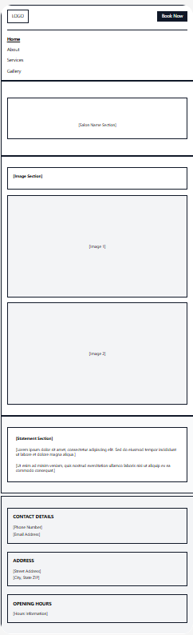
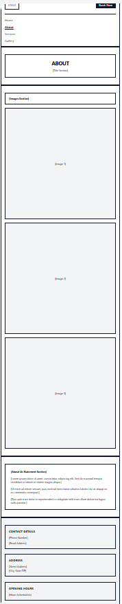
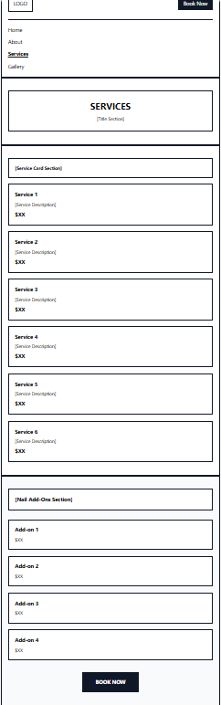
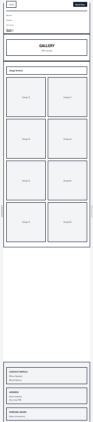

### Tablet Device

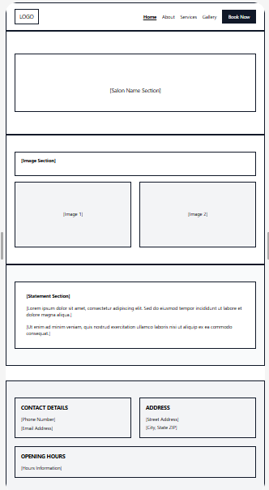
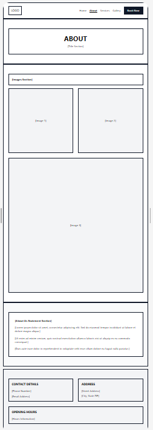
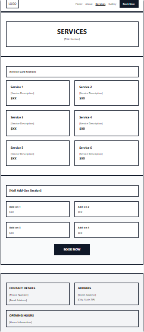
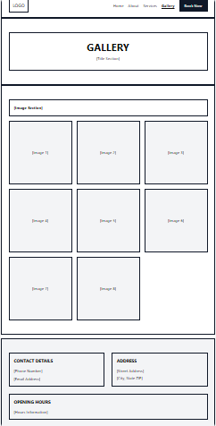

### Desktop Device

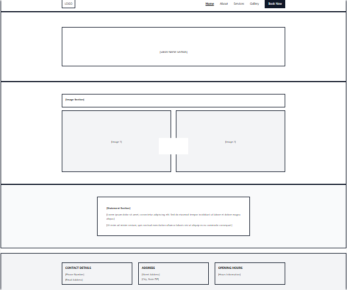
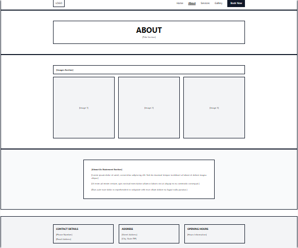
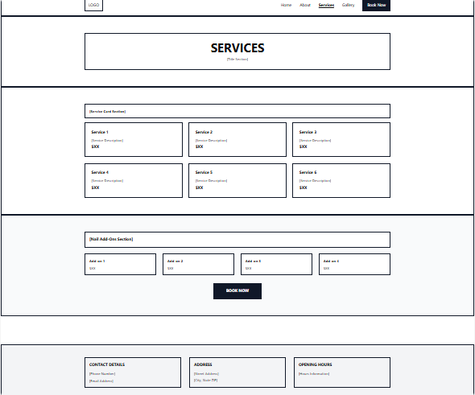
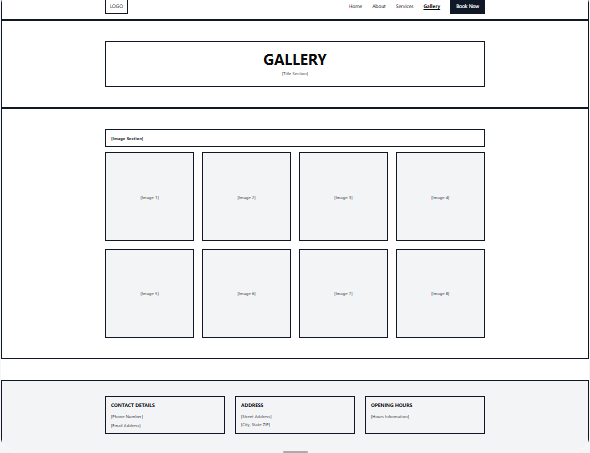

### Implemented application screenshots

The following screenshots show the delivered interface. Compare the
responsive navigation, homepage, menu, and reservation form with the original
wireframes above to see how the design direction was carried into the working
application. Account registration, login, and reservation management are
implemented as Django-rendered screens; they are not represented in the
original wireframe images. Some supplied screenshots are earlier captures and
may retain the previous Fire_Restaurant name; the current code uses Salt &
Smoke branding.

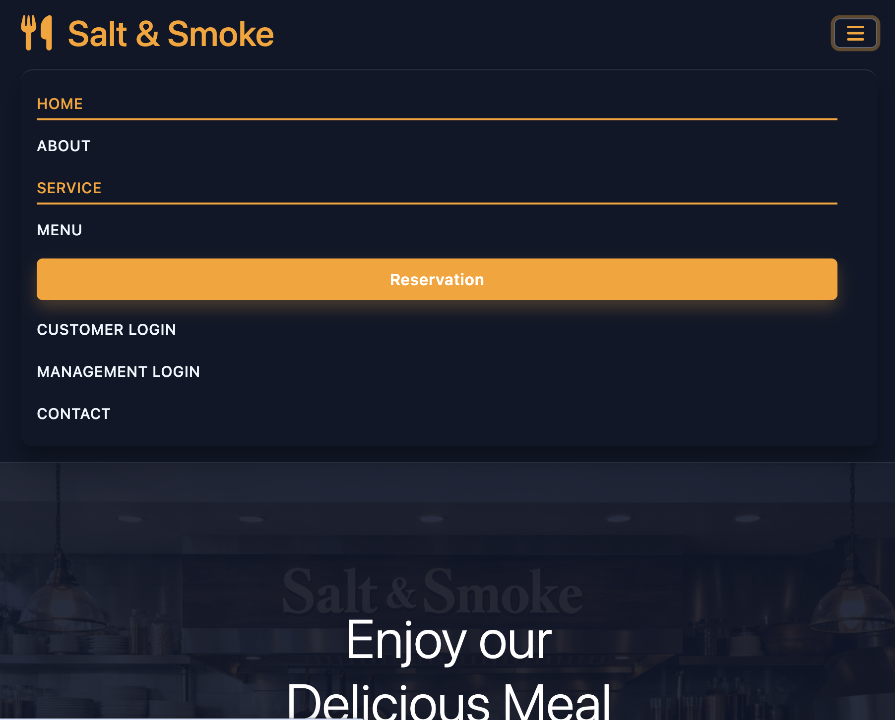
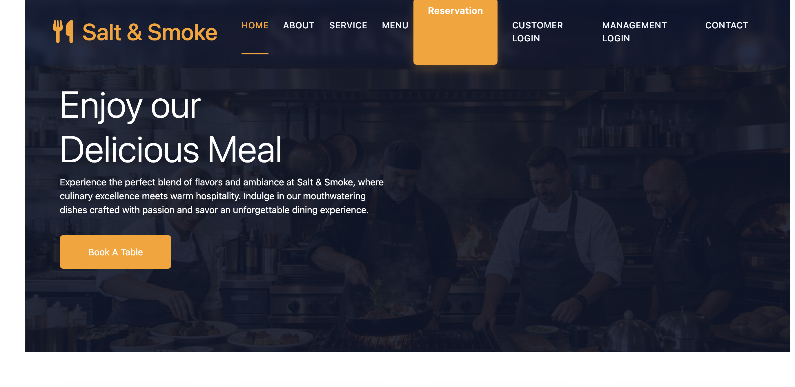
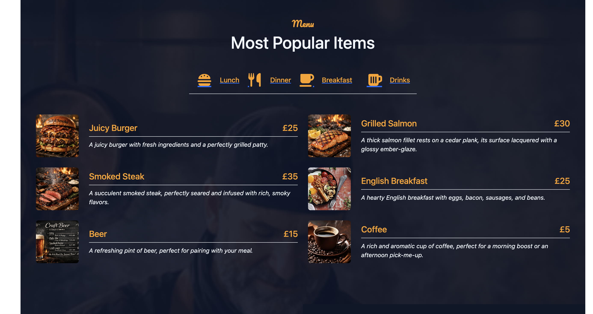
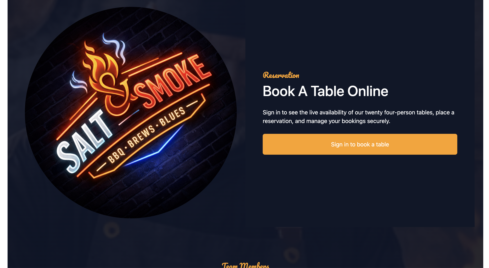


## Color Scheme
---

- #fea116 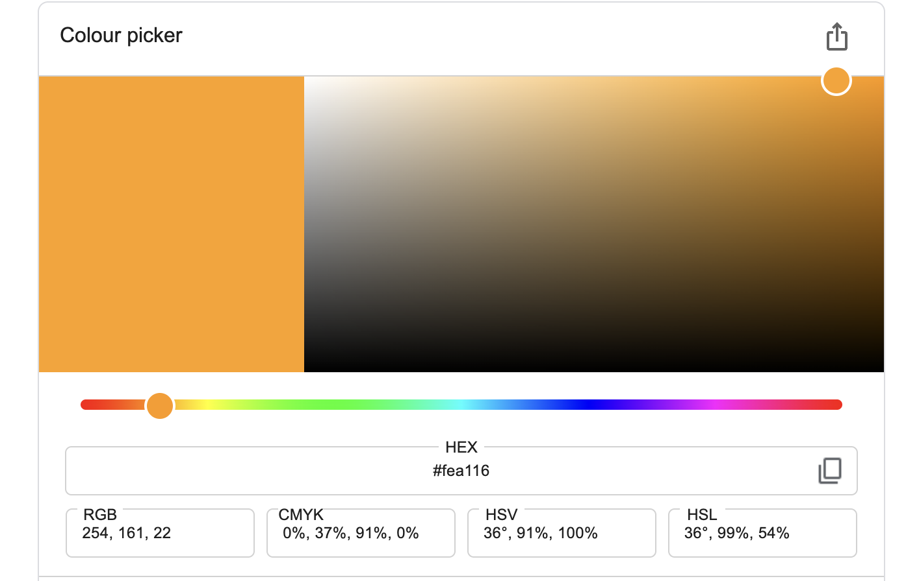

- #f1f8ff 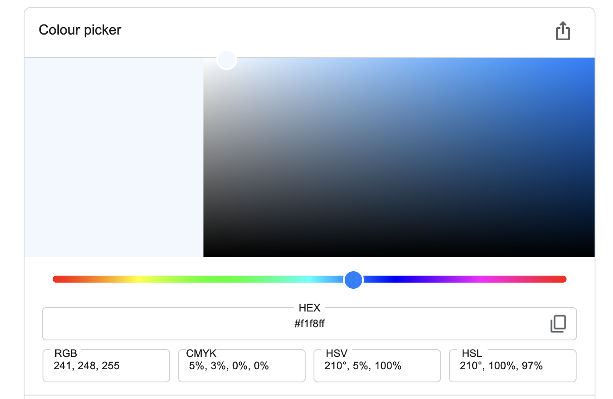

- #0f1728 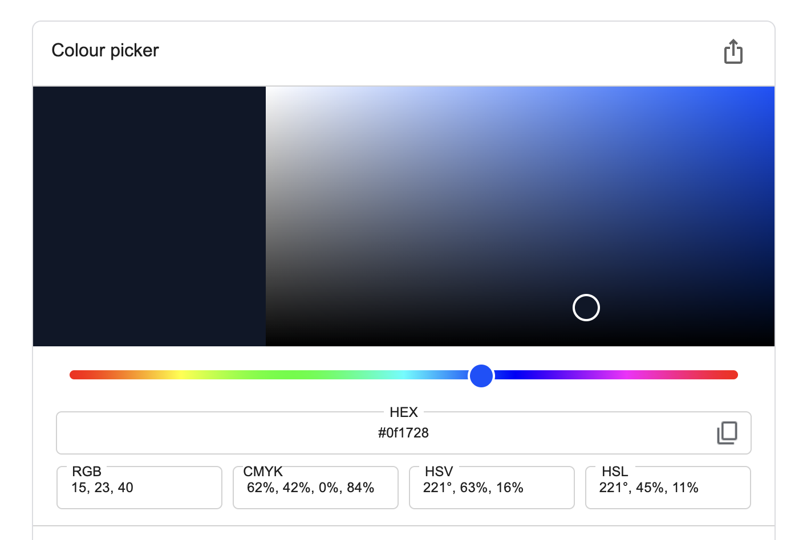

## Contrast Checker

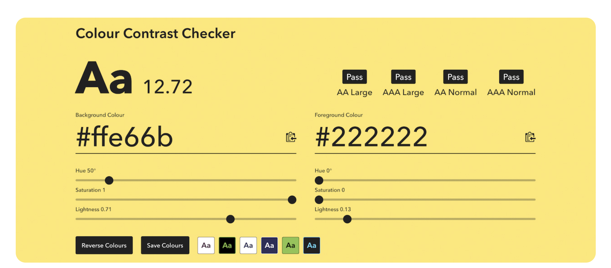


## Technologies Used
---

- HTML
- CSS
- Visual Studio Code
- Bootstrap V5
- Google Fonts
- GitHub
- Figma for wireframes
- Adobe Firefly to generate photos
- Adobe Express to resize images
- FontAwesome
- Favicon
- Contrast Checker
- TinyPNG to convert images to webp

## Testing
---

Testing is divided between Django backend tests, browser-level Playwright
tests, and manual quality checks. The Django tests exercise the full-stack
application and its test database. The Playwright configuration currently
starts a static `python3 -m http.server` for the legacy `index.html`; it does
not start Django, so it is not an end-to-end test of the deployed Django
application.

### Run automated tests

Install Python dependencies and the Node development dependencies, then run:

```bash
python manage.py check
python manage.py makemigrations --check --dry-run
python manage.py test restaurant
npm ci
npm test
```

The backend suite is in `restaurant/tests.py`. It covers:

| Area | Coverage |
| --- | --- |
| Authentication | Customer registration, login, dashboard access, and anonymous access restrictions. |
| Database CRUD | Reservation creation, reading, editing, and deletion; menu creation/editing in Django admin and menu creation/deletion through the staff API; newsletter persistence. |
| Permissions | Reservation ownership isolation, anonymous booking restrictions, staff-only API access, and Django admin access. |
| Reservation management | Availability, authenticated ownership, duplicate booking/table conflicts, and create/edit/cancel flows. |
| Form and API validation | Invalid reservation dates, party sizes, newsletter addresses/duplicates, and malformed JSON. |

The Playwright suite is in `tests/site.spec.ts` and is configured for Chromium
desktop and Pixel 5 mobile projects. Its cases cover client-side reservation,
newsletter and feedback validation; menu search/category filters; responsive
layout and mobile navigation; same-origin links; and runtime browser errors.
The specs also include regression scenarios for restoring an in-progress
reservation after reload, handling duplicate newsletter subscriptions, and
showing fallback text when reservation confirmation details are missing.

### Latest verification and known gaps

| Check | Latest result |
| --- | --- |
| `python3 manage.py check` | PASS — no Django system-check issues. |
| `python3 manage.py makemigrations --check --dry-run` | PASS — no ungenerated model changes. |
| `python3 manage.py test restaurant` | PASS — 19 tests. |
| `npm test` | FAIL — 24 failures (12 scenarios in each browser project). The static-server browser suite does not currently match the Django application UI reliably: tests report missing form selectors, failed interaction expectations, missing resources, and external resource connection resets. Responsive and regression specs exist, but this run does not verify them successfully. |
| `pycodestyle --statistics --count manage.py salt_smoke restaurant` | FAIL — 117 PEP 8 findings: 115 line-length (`E501`), one `E302`, and one `E305`. The check includes generated migrations; style is not yet enforced in CI. |
| Current HTML/CSS validation | NOT RUN against the deployed Django application. The repository's W3C screenshots are historical evidence from the earlier static site, not a current validation result. A local HTML Tidy attempt is not authoritative for this HTML5 markup, and no current CSS-validator report is recorded. |
| Accessibility audit | NOT RUN with an automated WCAG/axe checker. The Playwright specs use accessible labels and roles in places, but this is not a substitute for keyboard, screen-reader, contrast, and zoom testing. |

### Manual test plan

For each release, test the live application at desktop and mobile widths:

1. Navigate the site with keyboard only; check visible focus, logical tab order,
   form labels, error announcements, contrast, and zoom/reflow. Include a
   screen-reader check and run an automated accessibility audit.
2. Register a customer, sign in/out, create a booking, edit it, cancel it,
   and verify another customer cannot view or change that booking.
3. Sign in as staff; create, edit, and delete a menu item and verify that an
   unauthorised user cannot perform staff-only actions.
4. Submit valid and invalid reservation and newsletter forms; verify useful
   field-level errors and successful confirmation messages.
5. Check menu search/filter/reset, navigation links, page loading, and browser
   console/network errors at mobile, tablet, and desktop breakpoints.
6. Validate the current deployed HTML with the W3C Nu HTML Checker and its
   CSS with the W3C CSS Validation Service. Record the tested URLs, date,
   errors, and fixes rather than reusing reports from the older static site.
7. Re-run Django checks, migration checks, backend tests, Playwright, and a
   Python PEP 8 linter after fixes; attach current output or a dated test log.

### Bugs, fixes, and unresolved issues

The Playwright regression cases document previously targeted problems: a
reservation draft disappearing on reload, duplicate newsletter sign-up
handling, and missing reservation-confirmation fallback text. The Django
backend tests also guard reservation ownership, preventing anonymous booking,
and invalid/duplicate submissions. Because the latest Playwright run failed,
the browser regression cases cannot currently be reported as passing; rework
the browser test setup/selectors for the current Django experience and rerun
them before treating those frontend regressions as verified.

The outstanding testing work is the failing Playwright suite, the reported
PEP 8 findings, current W3C HTML/CSS validation, and a formal accessibility
audit. No separate unresolved-defect register is currently maintained; record
any further bugs found during release testing here with reproduction steps,
fix, regression test, and verification result.

## Screenshots
----

### Navbar


### Homepage


### About page

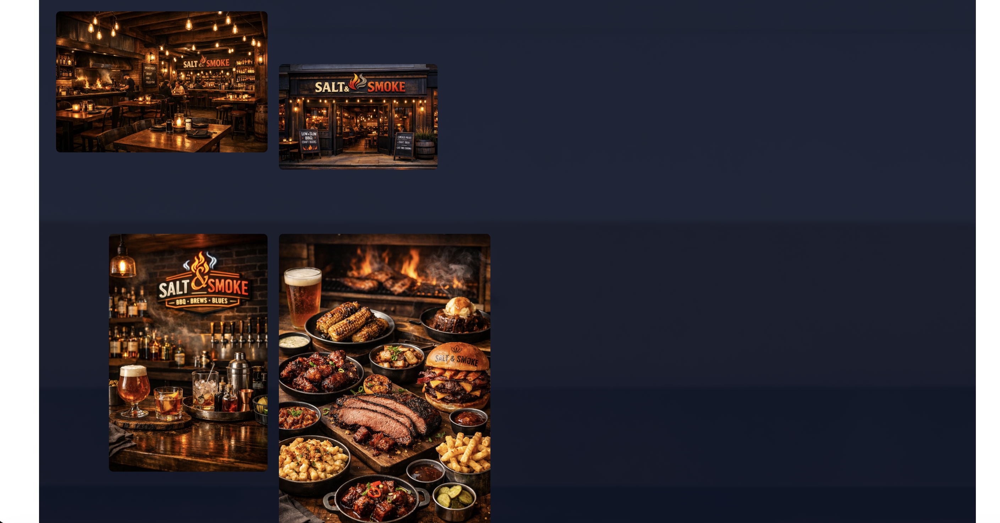
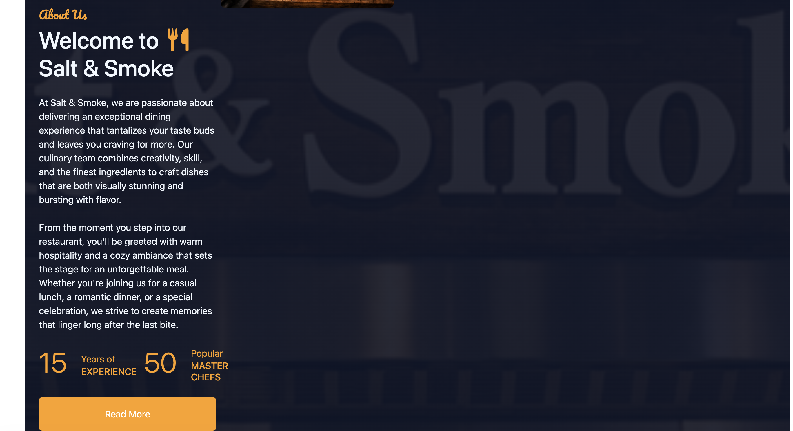

### Menu Page


### ReadMore Page

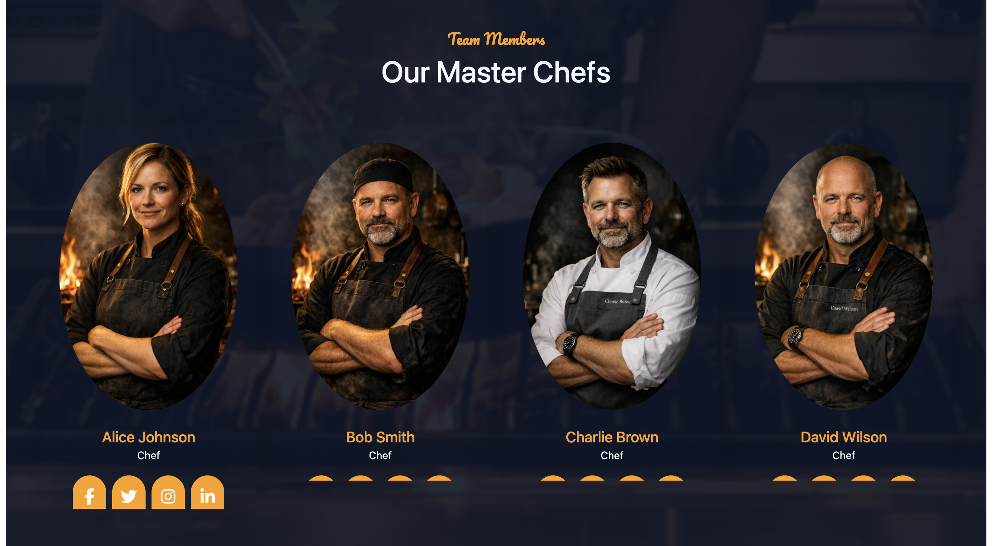

### Reservation Page


### Contact page

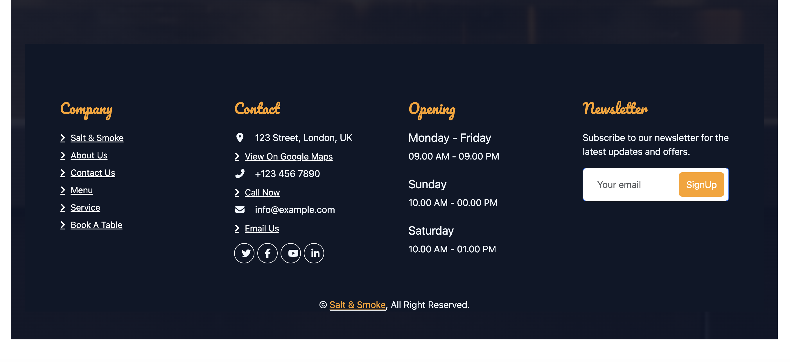

## Credits
---

### Content
- The welcome paragraph on the homepage.
- The testimonials in the reviewing section.
- Products on the products page with discount.

### Code
 - Custom CSS code was written by me.
 - Some HTML was imported directly from Bootstrap V5.3 
 - Grid systems 
 - rows, columns and cards. Navigation bar.

### Media and Photos
- All media and photos sourced from Google.

## Purpose and Value
---

This application is built to deliver practical value to users:

- **Fast reservations:** clear form validation and confirmation flow.
- **Quick menu discovery:** searchable and filterable menu items.
- **Simple communication:** newsletter sign-up with immediate feedback.
- **Ongoing engagement:** feedback submission with optional image upload.


## Features (Application)
---

- Responsive frontend (`index.html`, `style.css`)
- Sticky navbar with active section behavior
- Menu search + category filters + reset state
- Customer login and registration with Django session authentication
- Customer-only reservation dashboard with create, edit, and delete
- Live availability inventory for twenty four-seat tables, with past-date/time validation and database-enforced duplicate-slot prevention
- Newsletter validation and duplicate-subscription handling
- Feedback form with image constraints and preview
- Django API (`restaurant/`): SQLite locally; persistent PostgreSQL in production
  - `POST /api/reservations`, `GET /api/reservations`, `GET /api/reservations/:id`
  - `POST /api/newsletter/signup`, `GET /api/newsletter/signups`
  - `POST /api/menu`, `GET /api/menu`, `GET /api/menu/:id`, `PUT /api/menu/:id`, `DELETE /api/menu/:id`
  - `GET /api/health`, `GET /api/docs`
- Django models, validation forms, migrations, admin, and staff authentication

## Database schema and ERD
---

The Django ORM manages five application entities. Customer login and
registration use Django's built-in authentication user and an optional
one-to-one customer profile (`Customer.user` is nullable for legacy records).
Legacy customer records are not automatically claimed by matching an email address:
without verified email ownership, doing so could expose another person's
booking history. Each restaurant has twenty active tables by default, each
seating up to four people. A customer can have multiple reservations, but each
booking belongs to exactly one customer and one table. Reservation name and
email are also stored as booking-time snapshots. Newsletter subscribers and
menu items are independent records. SQLite is the local-development default;
production uses PostgreSQL configured with `DATABASE_URL`.

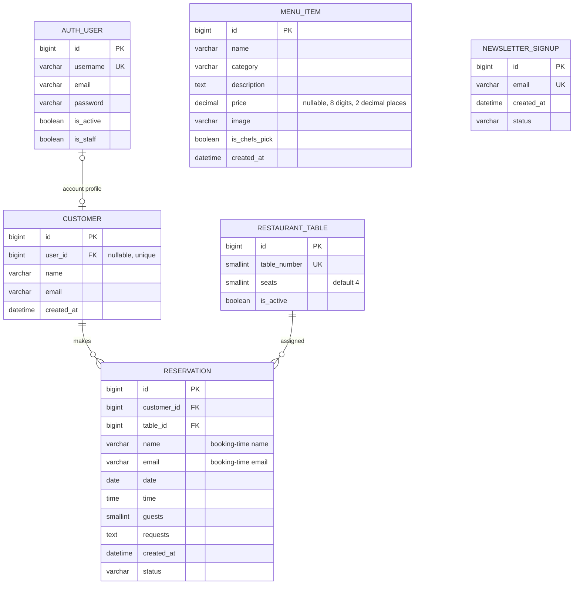

`CUSTOMER ||--o{ RESERVATION` means a customer may have zero or many
reservations, and each reservation belongs to exactly one customer. Each
reservation is assigned exactly one table; tables are reusable for different
date/time slots but have a database constraint preventing two bookings for the
same slot. A second database constraint prevents one customer from making
duplicate bookings at the same date and time. Customer and table references
use `PROTECT` to preserve booking history. Passwords and authentication tokens
are managed by Django, not stored as plaintext. `MENU_ITEM` and
`NEWSLETTER_SIGNUP` have no relationship to the other application entities.
Django's built-in user/group/permission tables support authentication.
`Customer.user` is nullable and unique, allowing legacy customer records that
do not have a login. Each reservation must have a customer and a table.

The reservation service seeds tables 1–20 with four seats each on migration.
Bookings accept 1–4 guests, and validation rejects past dates/times and
unavailable table slots.

## Restaurant management
---

Staff can sign in at `/admin/` to add, edit, and delete menu items, including
their category, description, price, image, and chef's-pick status. The admin
site also provides reservation, customer, table, and newsletter management.
The local development database has a superuser named `Admin`; change its
provided temporary password before deploying or sharing this database. Do not
store administrator passwords in this README, source control, or deployment
logs.

## Development Cycle (Documented with Commit Evidence)
---

The project was developed iteratively:

1. **Foundation and UI structure**  
   Built responsive layout and navigation behavior.
2. **Interactive user journeys**  
   Added menu filtering/search, reservation flow, newsletter, and feedback features.
3. **Validation and UX hardening**  
   Strengthened input validation, messaging, and accessibility details.
4. **Automated regression checks**  
   Expanded Playwright tests for critical user flows.
5. **Documentation and repository hygiene**  
   Improved README/API docs and removed generated artifacts from source control.

### Commit-message evidence

| Commit | Message | What it evidences |
|---|---|---|
| `2021e05` | `feat: add API docs route and clean generated artifacts` | API maintenance and repository cleanup |
| `1d11a16` | `feat: enhance README for clarity, structure, and comprehensive assessment mapping` | Documentation improvement |
| `936b4b4` | `feat(tests): enhance test coverage with improved validation and responsiveness checks` | Test coverage growth |
| `0faa2b5` | `feat: enhance newsletter email validation with length checks and error messaging` | Validation refinement |
| `901a40b` | `feat: implement menu category filters with reset functionality and update filter status display` | Interactive menu delivery |
| `cc5b2cc` | `feat: implement guest feedback wall with image support and time formatting` | Feedback feature implementation |

## Code Separation and External-Source Attribution
---

### Custom project code

The following files are written for this interactive application:

- `index.html`
- `submit.html`
- `style.css`
- `manage.py`
- `salt_smoke/`
- `restaurant/`
- `api-client.js`
- `api-integration-examples.js`
- `tests/site.spec.ts`

### External libraries and sources

The project uses these external dependencies:

- Bootstrap 5.3
- Font Awesome
- Google Fonts (Pacifico)
- WOW.js
- Django
- SQLite for local development
- PostgreSQL via `psycopg` for production
- Playwright

Attribution is applied in two places:

1. **In code comments:** `index.html` now includes comments above external CDN includes and WOW.js initialization.
2. **In this README:** this section explicitly lists all external dependencies.

## Technologies
---

### Frontend

- HTML5
- CSS3
- JavaScript (ES modules)
- Bootstrap 5.3
- Font Awesome

### Backend/API

- Python 3.10+
- Django 5.2
- SQLite for local development
- PostgreSQL for production (`DATABASE_URL`, `psycopg`)

### Testing

- Playwright (`@playwright/test`)

## Installation and Usage
---

### Prerequisites

- Python 3.10+
- pip

### Install

```bash
python3 -m venv .venv
source .venv/bin/activate
pip install -r requirements.txt
```

### Initialize the database and run the application

```bash
python manage.py migrate --fake-initial
python manage.py runserver 0.0.0.0:5000
```

This project reuses the existing `database.db` tables when present. For a fresh database, the same migration command creates them.

Create an authenticated staff account for the Django admin and protected API routes:

```bash
python manage.py createsuperuser
```

API base URL:

- `http://localhost:5000/api`

Health and docs:

- `http://localhost:5000/api/health`
- `http://localhost:5000/api/docs`

### Run tests

```bash
python manage.py test restaurant
```

## Project structure
---

```text
.
├── manage.py
├── requirements.txt
├── Procfile
├── .python-version
├── .gitignore
├── .slugignore
├── package.json
├── package-lock.json
├── playwright.config.ts
├── index.html
├── submit.html
├── style.css
├── api-client.js
├── api-integration-examples.js
├── assets/
│   └── img/
├── salt_smoke/                 # Django project configuration
│   ├── __init__.py
│   ├── settings.py             # database, security, static files, installed apps
│   ├── urls.py                 # project routes and frontend asset serving
│   ├── asgi.py
│   └── wsgi.py
├── restaurant/                 # Django application
│   ├── __init__.py
│   ├── apps.py
│   ├── models.py                # customers, reservations, tables, menu, signups
│   ├── forms.py
│   ├── views.py
│   ├── urls.py                  # app/API routes
│   ├── admin.py
│   ├── tests.py
│   ├── migrations/
│   │   ├── __init__.py
│   │   ├── 0001_initial.py
│   │   ├── 0002_customer_reservation_customer.py
│   │   ├── 0003_restauranttable_customer_user_reservation_table_and_more.py
│   │   └── 0004_alter_customer_email.py
│   └── templates/
│       └── restaurant/
│           ├── base.html
│           ├── register.html    # customer account registration
│           ├── login.html       # customer sign-in
│           └── reservations.html # account dashboard and booking management
├── tests/
│   └── site.spec.ts             # Playwright browser tests
├── .github/
│   └── workflows/
│       ├── static.yml
│       └── jekyll-gh-pages.yml
├── README-img/                  # documentation screenshots
├── README.md
├── API-DOCUMENTATION.md
├── API-QUICKSTART.md
├── API-SETUP-COMPLETE.md
└── DEPLOYMENT.md
```

Customer registration, login, and reservation management are rendered from
Django templates and handled by `restaurant/views.py`; they do not have
separate account or management JavaScript files. `index.html`, `submit.html`,
`style.css`, and the shared JavaScript files at the repository root are the
existing frontend assets served by the Django project.

## Heroku Deployment
---

The full-stack Django application is deployed to Heroku and uses Heroku
Postgres for persistent production data. Heroku dyno filesystems are
ephemeral, so SQLite is for local development only. The `Procfile` runs
Gunicorn and applies database migrations during the release phase; WhiteNoise
serves collected static files. The production site is
https://fire-restaurant-583481b558bc.herokuapp.com/.

### 1. Prepare the repository

Clone the repository and install the pinned Python dependencies from
`requirements.txt`:

```bash
git clone https://github.com/Hamid-aa80/Fire-Restaurant.git
cd Fire-Restaurant
python3 -m venv .venv
source .venv/bin/activate
python -m pip install --upgrade pip
pip install -r requirements.txt
```

Before deploying, check the Django configuration, pending migration files, and
automated tests:

```bash
python manage.py check
python manage.py makemigrations --check --dry-run
python manage.py test restaurant
```

Ensure the commit includes `Procfile`, `requirements.txt`, the Django project
and app, and all migration files. Do not commit secrets or the local SQLite
database (`.gitignore` excludes SQLite files). Commit and push the reviewed
changes to the branch intended for deployment.

### 2. Prepare the Heroku app and database

Install the Heroku CLI and authenticate:

```bash
heroku login
```

The live app's Heroku name is `fire-restaurant-583481b558bc`. For this
existing app, connect its Git remote:

```bash
heroku git:remote --app fire-restaurant-583481b558bc
```

For a new deployment instead, create an app with an available unique name
using `heroku create <app-name>`, then use that same app name and its generated
`<app-name>.herokuapp.com` host in the commands and config below.

Attach an available Heroku Postgres plan to the app in the Heroku Dashboard.
Heroku sets `DATABASE_URL` when the database is attached; do not put the
database URL in source control or replace it with a local SQLite path. Confirm
in the Dashboard that `DATABASE_URL` is set, but do not copy or share its
secret value.

Set the Python buildpack so Heroku installs the dependencies in
`requirements.txt`:

```bash
heroku buildpacks:set heroku/python --app fire-restaurant-583481b558bc
```

### 3. Configure production environment

Generate a unique Django secret key locally:

```bash
python3 -c "import secrets; print(secrets.token_urlsafe(50))"
```

Configure Django with a secret key, production mode, the deployed hostname,
and its HTTPS CSRF origin. `DATABASE_URL` is provided by Heroku Postgres and
does not need to be set in this command. Replace the placeholder key with the
generated value before running:

```bash
heroku config:set \
  DJANGO_SECRET_KEY='paste-the-generated-secret-here' \
  DJANGO_DEBUG=false \
  DJANGO_ALLOWED_HOSTS='fire-restaurant-583481b558bc.herokuapp.com' \
  DJANGO_CSRF_TRUSTED_ORIGINS='https://fire-restaurant-583481b558bc.herokuapp.com' \
  --app fire-restaurant-583481b558bc
```

Do not commit the generated secret. With `DJANGO_DEBUG=false`, production
settings enable HTTPS redirects and secure cookies and trust Heroku's TLS
proxy. The buildpack installs the pinned requirements and collects static
files for WhiteNoise.

### 4. Deploy and apply database migrations

For a Heroku Git deployment, push the reviewed commit to Heroku's `main`
branch (this works even when your local branch has a different name):

```bash
git push heroku HEAD:main
```

The `web` process in `Procfile` runs Gunicorn. Its `release` process runs
`python manage.py migrate` against the Postgres database before the new
release serves traffic. A failed migration prevents the release from being
promoted; inspect the build and release logs if deployment fails. If using
Heroku's GitHub integration, push the reviewed commit to the branch connected
to the app instead. Check deployment status and recent release history with:

```bash
heroku releases --app fire-restaurant-583481b558bc
heroku logs --tail --app fire-restaurant-583481b558bc
```

After deployment, confirm migrations are applied and run Django's system
check against the production configuration:

```bash
heroku run --app fire-restaurant-583481b558bc python manage.py showmigrations --plan
heroku run --app fire-restaurant-583481b558bc python manage.py check
```

### 5. Create an administrator and test the deployed app

Production starts with an empty Postgres database; local database records and
the local admin account are not transferred. Create a new superuser with a
unique, strong password:

```bash
heroku run --app fire-restaurant-583481b558bc python manage.py createsuperuser
```

The current production management login is
[https://fire-restaurant-583481b558bc.herokuapp.com/admin/login/](https://fire-restaurant-583481b558bc.herokuapp.com/admin/login/)
with username `manager`. The password is intentionally not documented here;
store and share it only through a secure password manager or other approved
secret-sharing channel, and rotate it if it has been exposed.

Verify these production URLs:

- Homepage: https://fire-restaurant-583481b558bc.herokuapp.com/
- Health check: https://fire-restaurant-583481b558bc.herokuapp.com/api/health
- Admin: https://fire-restaurant-583481b558bc.herokuapp.com/admin/
- Customer registration: https://fire-restaurant-583481b558bc.herokuapp.com/accounts/register/

The health endpoint should return `{"status": "API is running"}`. Also check
that the admin login page loads and that a customer can register, sign in,
create a reservation, and view it in their dashboard. Sign in to the admin
site and verify staff can create, edit, and delete a menu item. Review Heroku
logs for request or database errors. Existing local SQLite customers,
reservations, and menu records are not copied to Postgres; transfer any data
to retain through a separate, reviewed procedure.

For a compact copy of the Heroku-specific configuration and commands, see
[DEPLOYMENT.md](DEPLOYMENT.md).

## Disclaimer
---

This is a portfolio/educational project.

## Author
---

Built by Hamid.
